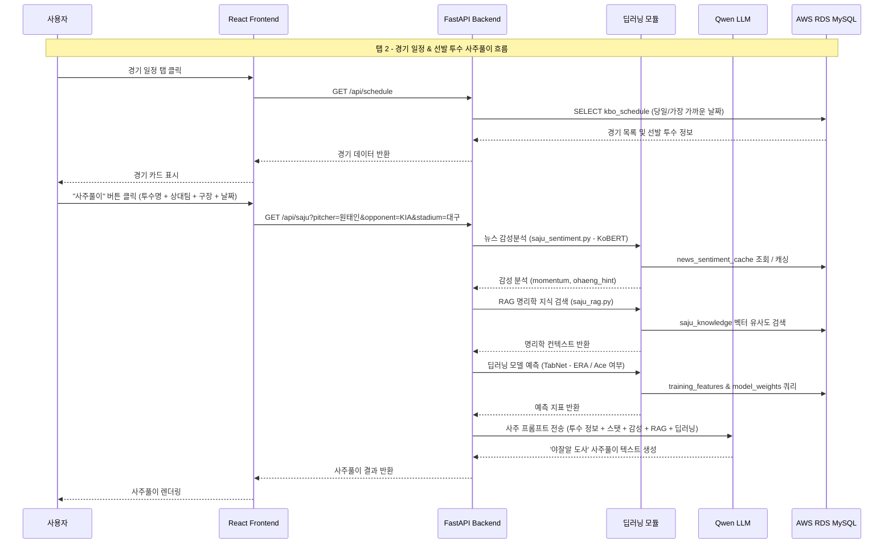
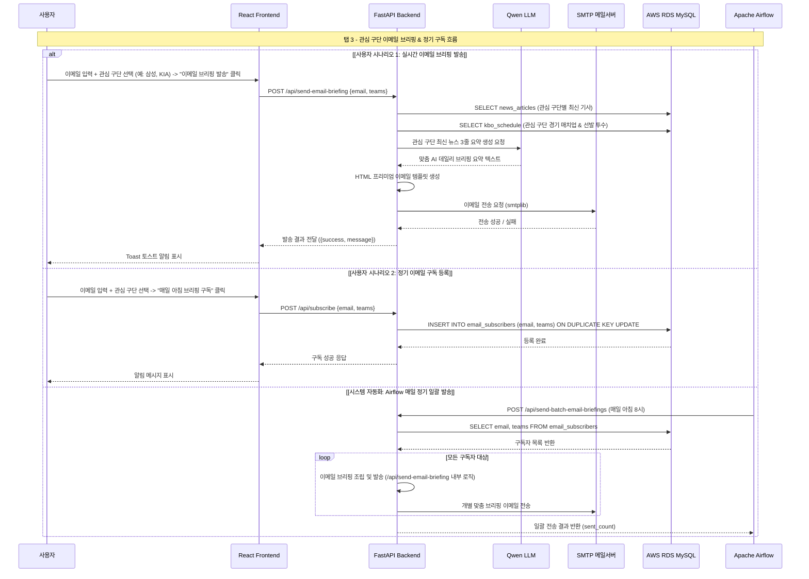

# ⚾ KBO AI 뉴스 캐스터 (KBO AI News Caster)

> **KBO 실시간 뉴스 조회 + Qwen LLM AI 브리핑 + 딥러닝 사주풀이 + 관심 구단 AI 이메일 브리핑 & 정기 구독**이 결합된 통합 스포츠 분석 대시보드 및 자동화 파이프라인

---

## 🗺️ 시스템 아키텍처

```mermaid
graph TB
    subgraph User["👤 사용자"]
        Browser["브라우저\nhttp://localhost:3000"]
    end

    subgraph Frontend["🖥️ Frontend (React)"]
        Tab1["탭 1\nKBO 실시간 뉴스 & AI 브리핑"]
        Tab2["탭 2\nKBO 경기 일정 & 투수 사주풀이"]
        Tab3["탭 3\n✉️ AI 이메일 브리핑 구독"]
    end

    subgraph Backend["⚙️ Backend (FastAPI :8000)"]
        API1["GET /api/news\n뉴스 목록 조회 (메타데이터)"]
        API2["GET /api/news/content\n기사 본문 Lazy Load"]
        API3["POST /api/summarize\nQwen LLM 3줄 브리핑"]
        API4["GET /api/schedule\n경기 일정 조회"]
        API5["GET /api/saju\n투수 사주풀이 생성"]
        API6["POST /api/send-email-briefing\n관심구단 이메일 브리핑 즉시발송"]
        API7["POST /api/subscribe\n정기 구독 등록"]
        API8["POST /api/send-batch-email-briefings\n정기 구독자 일괄 발송 (배치)"]
    end

    subgraph DL["🧠 딥러닝 모듈"]
        Sentiment["saju_sentiment.py\nKoBERT 감성분석\nsnunlp/KR-FinBert-SC"]
        RAG["saju_rag.py\nRAG 명리학 지식검색\nsentence-transformers"]
        SajuCore["saju.py\n사주 기둥 계산 + 스탯/뉴스/RAG 결합"]
        TabNet["saju_train_gpu.py / saju_prepare_training.py\nTabNet ERA/에이스 예측 모델"]
    end

    subgraph LLM["🤖 Qwen LLM"]
        QwenAPI["Qwen3.5-35B-A3B-FP8\nhttps://code.cu.ac.kr/llm/v1"]
    end

    subgraph EmailService["📧 이메일 서비스"]
        SMTP["SMTP 서버\n(Gmail / Custom SMTP)"]
        Recipient["구독자 / 사용자 이메일"]
    end

    subgraph DB["🗄️ AWS RDS MySQL"]
        NewsDB["total_db.news_articles\nKBO 뉴스 기사"]
        ScheduleDB["statistics_db.kbo_schedule\nKBO 경기 일정 & 선발투수"]
        UserInfoDB["total_db.user_info / email_subscribers\n구독자 이메일, Gmail 16자리 앱 비밀번호, 구단 정보"]
        SajuKB["total_db.saju_knowledge\n명리학 지식베이스 임베딩"]
        SentimentCache["total_db.news_sentiment_cache\n감성분석 캐시"]
        PitcherStats["statistics_db.kbo_pitcher_stats / training_features / model_weights\n투수 통계 및 딥러닝 가중치"]
    end

    subgraph Airflow["🔄 Apache Airflow (:8080)"]
        DAG_News["daum_news_crawler_dag\n뉴스 크롤링 자동화"]
        DAG_Sched["KBO_Schedule_crawling_dag\n경기일정/선발 수집"]
        DAG_Batch["send_batch_email_briefings\n정기 아침 이메일 발송"]
    end

    subgraph Crawling["🕷️ 크롤링 & ETL"]
        Selenium["Selenium Chrome (:4444)\nKBO 뉴스 & 경기 일정 수집"]
        Loader["load_news_to_mysql.py\nload_statistics_to_mysql.py"]
        KBOCrawler["kbo_crawler.py\nKBO 공식 스탯 크롤러"]
    end

    subgraph Spark["📊 Spark & Jupyter (:8889)"]
        PySpark["PySpark (workspace/etl_job.py)\n선수 통계 ETL 처리"]
    end

    Browser --> Tab1
    Browser --> Tab2
    Browser --> Tab3

    Tab1 --> API1
    Tab1 --> API2
    Tab1 --> API3
    Tab2 --> API4
    Tab2 --> API5
    Tab3 --> API6
    Tab3 --> API7

    API1 --> NewsDB
    API2 --> NewsDB
    API3 --> NewsDB
    API3 --> QwenAPI
    API4 --> ScheduleDB
    API5 --> SajuCore
    API6 --> NewsDB
    API6 --> ScheduleDB
    API6 --> QwenAPI
    API6 --> SMTP
    API7 --> SubscribersDB
    API8 --> SubscribersDB
    API8 --> API6

    SMTP --> Recipient

    SajuCore --> Sentiment
    SajuCore --> RAG
    SajuCore --> TabNet
    SajuCore --> QwenAPI
    Sentiment --> SentimentCache
    RAG --> SajuKB
    TabNet --> PitcherStats

    DAG_News --> Selenium
    DAG_Sched --> Selenium
    DAG_Batch --> API8
    Selenium --> Loader
    KBOCrawler --> PitcherStats
    Loader --> NewsDB
    Loader --> ScheduleDB
    PySpark --> DB
```



---

## 📊 데이터 흐름

### 1. 투수 사주풀이 흐름 (탭 2)



### 2. AI 이메일 브리핑 & 정기 구독 흐름 (탭 3)



---

## 🌟 주요 기능

### 탭 1 — KBO 실시간 뉴스 & AI 브리핑
- **속도 최적화 뉴스 목록 조회**: AWS RDS MySQL (`total_db.news_articles` 테이블)에서 본문(`content`)을 제외한 메타데이터만 1차 전송하여 **데이터 전송량을 99% 이상 절감 및 체감 0초대 로딩** 구현.
- **유연한 검색어 매핑**: 구단 약칭 및 풀네임, 영문명(기아/KIA/기아타이거즈, 엘지/LG, 쓱/SSG 등)에 대해 띄어쓰기를 무력화하는 정규화 매핑 알고리즘 적용.
- **본문 Lazy Loading**: 기사 클릭 시에만 `/api/news/content` 엔드포인트를 통해 해당 기사 본문을 실시간 쿼리 및 프론트엔드 메모리 캐싱.
- **Qwen 3.5 AI 3줄 키워드 브리핑**: `Qwen/Qwen3.5-35B-A3B-FP8` 모델을 통해 최근 기사 최대 15개를 백엔드에서 직접 스캔 후 Top 3 핵심 키워드 및 Fact 기반 요약문 자동 생성 (비동기 백그라운드 처리).

### 탭 2 — KBO 경기 일정 & 투수 사주풀이
- **당일 경기 자동 조회**: `statistics_db.kbo_schedule` 테이블에서 오늘 경기를 자동 필터링 (오늘 경기 미존재 시 가장 가까운 날짜 경기 자동 선택 및 선발 투수 미정 예외 방어).
- **'야잘알 도사' 콘셉트 사주풀이**: 투수명 + 상대팀 + 구장 + 경기 날짜 정보와 실시간 KBO 스탯을 융합하여 40년 경력 역술인 말투와 야구 밈이 결합된 사주풀이 생성 (Qwen LLM 연동).
- **KoBERT 감성분석 연동**: `snunlp/KR-FinBert-SC` (KoBERT 계열) 모델로 최근 기사 긍정/부정 비율 및 momentum(상승/하락/중립기운)을 판정하여 사주 프롬프트에 반영 (`saju_sentiment.py`).
- **RAG 명리학 지식베이스**: `sentence-transformers`(`paraphrase-multilingual-MiniLM-L12-v2`)로 명리학 지식 384차원 벡터 검색 후 LLM 컨텍스트로 주입 (`saju_rag.py`).
- **TabNet 딥러닝 예측 연동**: `training_features` 및 `model_weights` 테이블에서 가중치를 로드하여 선수의 다음 시즌 ERA 및 에이스 여부를 예측 후 사주풀이에 통합 (`saju_prepare_training.py` & `saju_train_gpu.py`).

### 탭 3 — 관심 구단 AI 이메일 브리핑 & 정기 구독 ✉️ [NEW]
- **관심 구단 다중 선택**: KBO 10개 구단(KIA, 삼성, LG, 두산, SSG, KT, 한화, 롯데, NC, 키움) 중 원하는 구단(들)을 자유롭게 선택.
- **즉시 이메일 브리핑 발송 (`POST /api/send-email-briefing`)**:
  - 선택한 관심 구단의 최신 기사 쿼리
  - `kbo_schedule` 테이블에서 해당 구단의 최근 경기 매치업 및 선발 투수 정보 추출
  - Qwen 3.5 LLM을 호출하여 관심 구단 팬들을 위한 데일리 3대 핵심 이슈 요약문 생성
  - 프리미엄 HTML 이메일 템플릿(반응형 CSS 디자인)을 제작하여 Python `smtplib`을 통해 사용자 이메일로 즉시 발송
  - SMTP 설정 미완료 시 시뮬레이션 모드로 안전 동작
- **정기 뉴스레터 구독 (`POST /api/subscribe`)**:
  - 사용자 이메일과 선택한 관심 구단 목록을 AWS RDS MySQL `total_db.email_subscribers` 테이블에 저장 (`ON DUPLICATE KEY UPDATE` 지원).
- **Airflow 매일 아침 일괄 발송 (`POST /api/send-batch-email-briefings`)**:
  - Apache Airflow 또는 크론 스케줄러가 매일 정해진 시각(예: 아침 8시)에 배치 API를 호출하여 등록된 모든 정기 구독자에게 최신 관심 구단 뉴스 및 경기 매치업/선발투수 브리핑 메일 자동 발송.

---

## 🛠️ 기술 스택

| 분류 | 기술 / 라이브러리 | 설명 |
|---|---|---|
| **프론트엔드** | React 18, Tailwind CSS | Create React App, 탭 기반 대시보드, 반응형 UI |
| **백엔드** | FastAPI, Uvicorn, Pydantic | 비동기 API 서버, CORS 미들웨어, OpenAPI Docs |
| **이메일 연동** | SMTP (`smtplib`, `email.mime`) | HTML 템플릿 기반 맞춤 메일 발송 |
| **LLM** | Qwen3.5-35B-A3B-FP8 | DCU LLM API (`https://code.cu.ac.kr/llm/v1`), OpenAI Python SDK 연동 |
| **딥러닝 (감성분석)** | PyTorch, Transformers | `snunlp/KR-FinBert-SC` (KoBERT 계열 뉴스 감성분석) |
| **딥러닝 (RAG)** | Sentence-Transformers | `paraphrase-multilingual-MiniLM-L12-v2` (384차원 벡터 검색) |
| **딥러닝 (예측)** | PyTorch TabNet, Scikit-learn | `pytorch-tabnet` (투수 ERA 회귀 & 에이스 분류) |
| **데이터베이스** | AWS RDS MySQL (`pymysql`, `SQLAlchemy`) | `total_db`, `statistics_db` 멀티 데이터베이스 |
| **크롤링 & 데이터수집**| Selenium (Remote Chrome), Playwright, BeautifulSoup4 | 다음 스포츠 뉴스, KBO 경기 일정/선발투수, KBO 공식 스탯 |
| **워크플로우 / 배치** | Apache Airflow 2.7.1 (SequentialExecutor) | 뉴스/일정 크롤링 DAG, 정기 이메일 브리핑 배치 |
| **데이터 ETL / 분석** | Apache Spark (PySpark), Jupyter Lab | PySpark 기반 대용량 선수 통계 ETL |
| **컨테이너화** | Docker, Docker Compose | 다중 서비스 오케스트레이션 |

---

## 📁 프로젝트 구조

```
newsreport/
├── compose.yml                  # 전체 서비스 Docker Compose 정의 (Frontend, Backend, Airflow, Selenium, Spark, Postgres)
├── Dockerfile                   # Airflow 커스텀 이미지 빌드 설정 (필수 Python 패키지 포함)
├── requirements.txt             # Python 의존성 패키지 목록
├── .env                         # 환경변수 (AWS RDS, Qwen API Key, SMTP 설정 등)
├── .env.example                 # 환경변수 템플릿 파일
├── saju.py                      # 핵심 사주풀이 엔진 (Qwen LLM, 스탯/뉴스/RAG/감성/TabNet 결합)
├── kbo_crawler.py               # Playwright 기반 KBO 공식 역대 투수/타자 스탯 크롤러
├── load_news_to_mysql.py        # 크롤링 뉴스 CSV 데이터 정제 및 MySQL(total_db.news_articles) 적재
├── load_statistics_to_mysql.py  # KBO 공격/수비/일정 데이터 정제 및 MySQL(statistics_db) 적재
├── spark-defaults.conf          # Spark 설정 파일 (MySQL 커넥터 설정)
├── backend/
│   ├── Dockerfile               # FastAPI 전용 Dockerfile
│   ├── main.py                  # FastAPI 엔드포인트 (뉴스, 요약, 일정, 사주, 이메일 발송, 구독, 배치)
│   └── saju.py                  # (루트 saju.py 참조용 모듈)
├── deep_learning/
│   ├── saju_sentiment.py        # KoBERT 뉴스 감성분석 (Fallback: 키워드 룰 분석)
│   ├── saju_rag.py              # 명리학 RAG 지식베이스 벡터 검색 (Fallback: FULLTEXT 검색)
│   ├── saju_prepare_training.py # 딥러닝 학습 피처 엔지니어링 및 DB(training_features) 저장
│   └── saju_train_gpu.py        # GPU 전용 TabNet 딥러닝 모델 학습 및 가중치(model_weights) 저장
├── airflow_project/
│   ├── airflow.cfg              # Airflow 설정 파일
│   ├── webserver_config.py      # Airflow 웹서버 UI 설정
│   └── dags/
│       ├── daum_news_crawler_dag.py     # 다음 KBO 실시간/랭킹 뉴스 크롤링 DAG
│       ├── KBO_Schedule_crawling_dag.py # KBO 오늘/내일 경기 일정 및 선발투수 크롤링 DAG
│       └── kbo_player_data_dag.py       # KBO 선수 통계 크롤링 파이프라인 DAG
├── Crawling/
│   ├── daum_news_crawler.py     # 단독 실행형 다음 뉴스 크롤러 (더보기 클릭 루프)
│   ├── KBO_Schedule_crawling.py # 단독 실행형 KBO 경기 일정 크롤러
│   ├── KBO_record_crawling.py   # 단독 실행형 KBO 기록 크롤러
│   ├── daum_piter_crawler.py    # 다음 뉴스 파이프라인 헬퍼
│   └── daum_rank_crawler.py     # 다음 랭킹 뉴스 크롤러
├── kbo-ui/                      # React 프론트엔드 앱
│   ├── Dockerfile               # React 앱 전용 Dockerfile
│   ├── package.json             # NPM 패키지 정의
│   └── src/
│       ├── App.js               # 메인 React UI 컴포넌트 (뉴스, 사주, 이메일 구독 탭)
│       └── index.css            # Tailwind CSS 및 스타일링
└── workspace/
    └── etl_job.py               # PySpark 기반 타자/투수 데이터 ETL 스크립트
```

---

## 🐳 Docker 서비스 구성

| 서비스 명 | 컨테이너 명 | 포트 매핑 | 설명 |
|---|---|---|---|
| `kbo-frontend` | `kbo-frontend` | `3000:3000` | React 웹 대시보드 (http://localhost:3000) |
| `backend` | `kbo-backend` | `8000:8000` | FastAPI 백엔드 API (http://localhost:8000/docs) |
| `airflow-webserver` | `airflow-webserver` | `8080:8080` | Airflow 웹 UI (계정: `admin` / `admin`) |
| `airflow-scheduler` | `airflow-scheduler` | - | Airflow DAG 스케줄러 실행기 |
| `postgres` | `airflow-postgres` | `5432:5432` | Airflow 메타데이터 저장용 PostgreSQL 15 |
| `selenium-chrome` | `selenium-chrome` | `4444:4444` | 뉴스/경기 일정 크롤링 전용 Chrome 컨테이너 |
| `spark-jupyter` | `spark-container` | `8889:8888`, `4045:4040` | PySpark + Jupyter Lab (Token: `spark123`) |

---

## 🚀 실행 방법

### 1. 환경변수 설정 (`.env`)

`.env.example` 파일을 복사하여 `.env` 파일을 생성하고 본인의 설정값을 입력합니다.

```bash
cp .env.example .env
```

`.env` 설정 항목:
```env
# AWS RDS MySQL 연결 설정
AWS_RDS_ENDPOINT=database-1.cf0ecym6emk4.ap-southeast-2.rds.amazonaws.com
DB_PORT=3306
DB_USER=admin
DB_PASSWORD=your_password
DB_NAME=total_db

# Qwen LLM API 설정
QWEN_API_KEY=your_qwen_api_key
LLM_BASE_URL=https://code.cu.ac.kr/llm/v1

# SMTP 이메일 발송 설정 (이메일 브리핑용)
SMTP_SERVER=smtp.gmail.com
SMTP_PORT=587
SMTP_USER=your_email@gmail.com
SMTP_PASSWORD=your_app_password
```

### 2. Docker Compose로 전체 시스템 구동

```powershell
# Windows PowerShell 기준
$env:PATH = "C:\Program Files\Docker\Docker\resources\bin;" + $env:PATH
docker compose up -d --build
```

### 3. 주요 서비스 접속 URL

| 서비스 | URL | 비고 |
|---|---|---|
| **KBO 웹 대시보드** | [http://localhost:3000](http://localhost:3000) | React 프론트엔드 |
| **FastAPI Swagger 문서** | [http://localhost:8000/docs](http://localhost:8000/docs) | API 대화형 테스트 |
| **Airflow 관리자 UI** | [http://localhost:8080](http://localhost:8080) | ID/PW: `admin` / `admin` |
| **Jupyter Lab (Spark)** | [http://localhost:8889](http://localhost:8889) | Token: `spark123` |

---

## 🔌 API 엔드포인트 명세

| Method | Endpoint | Description | Request Body / Query Params |
|---|---|---|---|
| `GET` | `/api/news` | KBO 뉴스 목록 조회 (메타데이터 속도 최적화) | `query` (선택, 구단명/키워드) |
| `GET` | `/api/news/content` | 기사 본문 개별 로드 (Lazy Loading) | `title` (기사 제목) |
| `POST` | `/api/summarize` | Qwen LLM 기반 Top 3 키워드 AI 3줄 요약 | `{"query": "삼성"}` |
| `GET` | `/api/schedule` | 당일 KBO 경기 일정 및 선발 투수 조회 | - |
| `GET` | `/api/saju` | '야잘알 도사' 선발 투수 사주풀이 생성 | `pitcher`, `opponent`, `stadium`, `date`, `my_team` |
| `POST` | `/api/send-email-briefing` | 관심 구단 뉴스 & 선발투수 이메일 즉시 발송 | `{"email": "user@example.com", "teams": ["삼성", "KIA"]}` |
| `POST` | `/api/subscribe` | 관심 구단 정기 뉴스레터 구독 등록 | `{"email": "user@example.com", "teams": ["삼성", "KIA"]}` |
| `POST` | `/api/send-batch-email-briefings` | Airflow 배치용 정기 구독자 일괄 발송 | - |

---

## 🗄️ 데이터베이스 스키마 명세 (AWS RDS MySQL)

### `total_db.news_articles` (KBO 뉴스 기사)
- `date` (DATETIME): 기사 작성 일시
- `title` (VARCHAR 500): 기사 제목
- `press` (VARCHAR 200): 언론사 명
- `content` (TEXT): 기사 본문
- `category` (VARCHAR 50): 스포츠 카테고리 (`KBO`, `MLB`, `EPL` 등)
- `url` (VARCHAR 1000): 원본 기사 URL

### `statistics_db.kbo_schedule` (KBO 경기 일정 및 매치업)
- `game_date` / `date` (VARCHAR 20): 경기 날짜 (`YYYYMMDD` 또는 `YYYY.MM.DD`)
- `game_time` / `time` (VARCHAR 20): 경기 시각 (`18:30` 등)
- `away_team` (VARCHAR 50) / `home_team` (VARCHAR 50): 원정팀 및 홈팀 명
- `stadium` (VARCHAR 100): 경기장 명
- `game_status` / `status` (VARCHAR 200): 경기 상태 (`종료`, `예정`, `우천취소`)
- `away_pitcher` (VARCHAR 50) / `home_pitcher` (VARCHAR 50): 원정 및 홈 선발 투수 이름

### `total_db.email_subscribers` ✉️ (이메일 정기 구독자)
- `id` (INT AUTO_INCREMENT PRIMARY KEY)
- `email` (VARCHAR 255 UNIQUE): 구독자 이메일 주소
- `teams` (VARCHAR 255): 관심 구단 목록 (쉼표 구분, 예: `삼성,KIA`)
- `created_at` (DATETIME DEFAULT CURRENT_TIMESTAMP): 구독 등록 일시

### `total_db.saju_knowledge` (명리학 RAG 지식베이스)
- `id` (INT AUTO_INCREMENT PRIMARY KEY)
- `category` (VARCHAR 100): 명리학 범주 (`오행_상생`, `천간_갑목` 등)
- `content` (TEXT): 명리학 지식 청크 텍스트
- `embedding` (JSON): 384차원 임베딩 벡터 리스트

### `total_db.news_sentiment_cache` (뉴스 감성분석 캐시)
- `title_hash` (VARCHAR 64 UNIQUE): 뉴스 제목 SHA256 해시
- `positive` (FLOAT) / `negative` (FLOAT) / `neutral` (FLOAT): 긍부정 비율
- `momentum` (VARCHAR 20): 기운 판정 (`상승기운`, `하락기운`, `중립기운`)

### `statistics_db.kbo_pitcher_stats` & `training_features` (딥러닝 스탯)
- `era`, `whip`, `so_per_9`, `bb_per_9`, `hr_per_9`, `k_bb_ratio`, `era_z`, `opp_ops`, `label_era`, `label_ace` 등 파생 피처 및 레이블 포함.

---

## 🧠 딥러닝 Fallback 메커니즘

시스템은 딥러닝 모듈 라이브러리 설치 여부에 따라 가용 기능을 자동 조율하는 안전한 **Fallback 메커니즘**을 지원합니다.

```
뉴스 감성 분석 (deep_learning/saju_sentiment.py)
  ├─ transformers & PyTorch 설치됨  → KoBERT (snunlp/KR-FinBert-SC) 추론 ✅
  └─ 미설치 시                      → 키워드 기반 룰(Rule-based) 감성 분석 자동 대체

RAG 명리학 지식검색 (deep_learning/saju_rag.py)
  ├─ sentence-transformers 설치됨   → 384차원 코사인 유사도 벡터 검색 ✅
  └─ 미설치 시                      → MySQL FULLTEXT / LIKE 키워드 검색 자동 대체

TabNet 모델 추론 (deep_learning/saju_train_gpu.py)
  ├─ pytorch-tabnet & 가중치 존재   → 다음 시즌 ERA 회귀 & 에이스 여부 분류 ✅
  └─ 미존재 시                      → KBO 시즌 통계 기반 동적 오행 스탯으로 자동 대체
```

---

## 📄 라이선스 및 문의
- © 2026 **KBO AI News Caster**. All rights reserved.
- 본 프로젝트는 KBO 공식 데이터 및 다음 스포츠 뉴스를 바탕으로 AI 브리핑 및 사주풀이를 제공하는 연구/포트폴리오 용도 시스템입니다.
