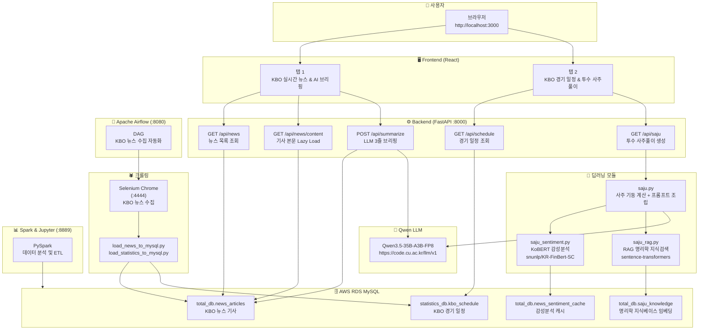
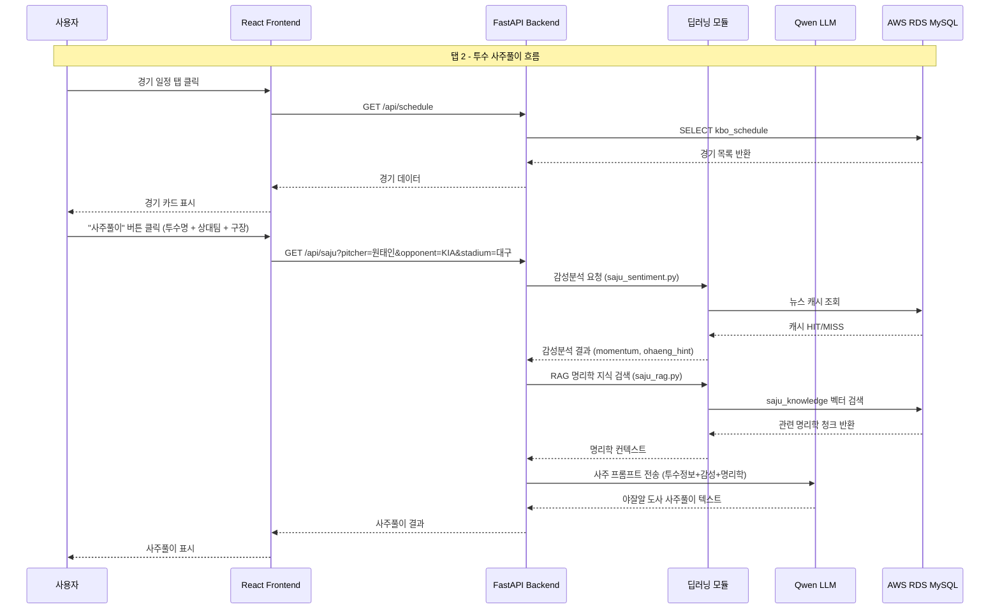

# ⚾ KBO AI 뉴스 캐스터

> **KBO 실시간 뉴스 조회 + Qwen LLM 기반 AI 브리핑 + 딥러닝 사주풀이**가 결합된 통합 스포츠 분석 대시보드

---

## 🗺️ 시스템 아키텍처



---

## 📊 데이터 흐름



---

## 🌟 주요 기능

### 탭 1 — KBO 실시간 뉴스 & AI 브리핑
- **뉴스 목록 조회**: AWS RDS MySQL(`news_articles` 테이블)에서 KBO 카테고리 기사를 빠르게 불러옵니다. (본문 제외 메타데이터만 전송하여 속도 최적화)
- **구단명 검색**: 기아, 삼성, LG, SSG, 키움, 한화, 롯데, NC, KT, 두산 등 구단 약칭·풀네임 모두 지원
- **기사 본문 Lazy Loading**: 기사 클릭 시 해당 기사 본문만 실시간으로 가져옵니다.
- **Qwen 3.5 AI 3줄 브리핑**: `Qwen/Qwen3.5-35B-A3B-FP8` 모델을 통해 최근 기사 최대 15개를 분석, Top 3 키워드 기반 요약문 자동 생성

### 탭 2 — KBO 경기 일정 & 투수 사주풀이
- **당일 경기 자동 조회**: `statistics_db.kbo_schedule` 테이블에서 오늘 경기를 필터링 (오늘 경기 없을 시 가장 가까운 날짜 자동 선택)
- **선발 투수 사주풀이**: 투수 이름 + 상대팀 + 구장 정보를 기반으로 **'야잘알 도사'** 콘셉트의 명리학 분석문 생성 (Qwen LLM 연동)
- **딥러닝 감성분석 연동**: KoBERT(`snunlp/KR-FinBert-SC`) 기반 뉴스 감성분석 결과를 사주 프롬프트에 반영
- **RAG 명리학 지식베이스**: `sentence-transformers`(`paraphrase-multilingual-MiniLM-L12-v2`)로 명리학 지식 벡터 검색 후 LLM 컨텍스트로 주입

---

## 🛠️ 기술 스택

| 분류 | 기술 |
|---|---|
| **프론트엔드** | React (Create React App) |
| **백엔드** | FastAPI (Python), Uvicorn |
| **LLM** | Qwen3.5-35B-A3B-FP8 (DCU LLM API) |
| **딥러닝 (감성분석)** | Transformers, `snunlp/KR-FinBert-SC` (KoBERT 계열) |
| **딥러닝 (RAG)** | Sentence-Transformers, `paraphrase-multilingual-MiniLM-L12-v2` |
| **데이터베이스** | AWS RDS MySQL (`pymysql`) |
| **크롤링** | Selenium (Docker), BeautifulSoup4 |
| **워크플로우** | Apache Airflow 2.7.1 (SequentialExecutor) |
| **데이터 처리** | Apache Spark (PySpark), Jupyter Lab |
| **컨테이너** | Docker Compose |

---

## 📁 프로젝트 구조

```
newsreport/
├── compose.yml                  # 전체 서비스 Docker Compose 정의
├── Dockerfile                   # Airflow 커스텀 이미지 빌드 설정
├── requirements.txt             # Python 의존성 목록
├── .env                         # 환경변수 (AWS RDS, Qwen API Key 등)
├── saju.py                      # 핵심 사주풀이 로직 (Qwen LLM 연동)
├── kbo_crawler.py               # KBO 뉴스 크롤러
├── load_news_to_mysql.py        # 뉴스 데이터 MySQL 적재 스크립트
├── load_statistics_to_mysql.py  # 경기 일정 데이터 MySQL 적재 스크립트
├── backend/
│   └── main.py                  # FastAPI 엔드포인트 정의
├── deep_learning/
│   ├── saju_sentiment.py        # KoBERT 뉴스 감성분석 (Fallback: 키워드 룰)
│   ├── saju_rag.py              # 명리학 RAG 지식베이스 (Fallback: FULLTEXT)
│   └── saju_train_gpu.py        # GPU 학습 스크립트
├── airflow_project/dags/        # Airflow DAG 파일
├── kbo-ui/src/App.js            # React 메인 UI 컴포넌트
└── workspace/etl_job.py         # ETL 작업 스크립트
```

---

## 🐳 Docker 서비스 구성

| 서비스 | 포트 | 설명 |
|---|---|---|
| `airflow-webserver` | `8080` | Airflow 웹 UI (admin/admin) |
| `airflow-scheduler` | - | DAG 스케줄 실행 |
| `airflow-postgres` | `5432` | Airflow 메타데이터 DB |
| `kbo-backend` | `8000` | FastAPI 백엔드 |
| `kbo-frontend` | `3000` | React 프론트엔드 |
| `selenium-chrome` | `4444` | 뉴스 크롤링용 Chrome |
| `spark-jupyter` | `8889` | PySpark + Jupyter Lab (Token: spark123) |

---

## 🚀 실행 방법

### 1. 환경변수 설정

```bash
cp .env.example .env
# .env 파일에서 AWS RDS, Qwen API 키 입력
```

### 2. Docker로 전체 실행

```powershell
# Windows PowerShell
$env:PATH = "C:\Program Files\Docker\Docker\resources\bin;" + $env:PATH
docker compose up -d
```

### 3. 접속 URL

| 서비스 | URL |
|---|---|
| **프론트엔드** | http://localhost:3000 |
| **백엔드 API 문서** | http://localhost:8000/docs |
| **Airflow UI** | http://localhost:8080 |
| **Jupyter Lab** | http://localhost:8889 |

---

## 🔌 API 엔드포인트

| Method | Endpoint | 설명 |
|---|---|---|
| `GET` | `/api/news?query=삼성` | KBO 뉴스 목록 조회 |
| `GET` | `/api/news/content?title=제목` | 기사 본문 Lazy Loading |
| `POST` | `/api/summarize` | Qwen LLM 3줄 AI 브리핑 |
| `GET` | `/api/schedule` | KBO 경기 일정 조회 |
| `GET` | `/api/saju?pitcher=원태인&opponent=KIA&stadium=대구` | 투수 사주풀이 생성 |

---

## 🧠 딥러닝 Fallback 구조

```
감성분석 (saju_sentiment.py)
  ├─ transformers 설치됨 → KoBERT (snunlp/KR-FinBert-SC) ✅
  └─ 미설치 시           → 키워드 기반 룰 분석 (자동 대체)

RAG 명리학 지식검색 (saju_rag.py)
  ├─ sentence-transformers 설치됨 → 384차원 벡터 유사도 검색 ✅
  └─ 미설치 시                    → MySQL FULLTEXT 검색 (자동 대체)
```

딥러닝 패키지 설치:
```bash
pip install transformers torch sentencepiece sentence-transformers
```
